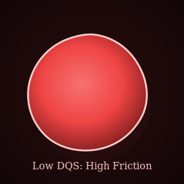
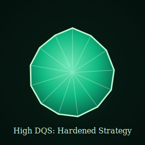

# Boardroom: Enough Thinking.
**The Multi-Agent Strategic Governance Engine.**

Boardroom transforms raw ideas into investment-grade strategy decisions. It combines Socratic auditing with adversarial multi-agent debate so each decision is mathematically scored, semantically validated, and stress-tested before execution.

## The Nucleus: Visualizing Integrity
At the center of Boardroom is **DecisionPulse2D**: a kinetic SVG nucleus representing strategic integrity in real time.

- **Healthy tension:** Slight asymmetry signals constructive friction from specialized reviewers (CFO, CTO, Compliance, Red Team).
- **Crystallization:** As logic hardens from draft to executable plan, the pulse shifts from a fluid blob into a faceted polyhedral form.
- **Truthful geometry:** Shape deformation is driven by weighted agent vectors, not decorative animation.

## Core Workflow
1. **The Forge**: Draft the strategy with the **Socratic Observer**, which exposes logic gaps and issues research pills.
2. **Red Team Mode**: Activate adversarial review to generate **Risk Pills** that must be mitigated.
3. **The Arena**: Specialized agents debate in a circular arena and physically tug the Nucleus in real time.
4. **The Artifact**: Generate an immutable executive report with full run history and a final decision stamp.

## Governance Framework
- **Decision Quality Score (DQS):** Final score blends strategic substance, hygiene, dissent penalties, and confidence penalties.
- **Semantic Mitigation Gate:** Mitigations are accepted only when the substance validator confirms causal, executable logic.
- **Run Memory:** Every run is persisted as a board sentiment snapshot for deltas, replay, and longitudinal learning.

## Quick Start
1. Install dependencies: `npm install`
2. Start local stack with demo data: `npm run local:start:demo`
3. Open `http://localhost:3000`
4. Run the critical-state walkthrough: [docs/walkthrough.md](docs/walkthrough.md)

## Documentation Map
- Governance math and integrity model: [docs/architecture.md](docs/architecture.md)
- Agent personas and strategic friction matrix: [GUIDE_AGENTS.md](GUIDE_AGENTS.md)
- API contract (including semantic gate): [docs/api.md](docs/api.md)
- Documentation index: [docs/README.md](docs/README.md)

## Non-Technical Local Start
For PM/CEO/founder setup with guided prompts: [docs/non-technical-local-run.md](docs/non-technical-local-run.md)
