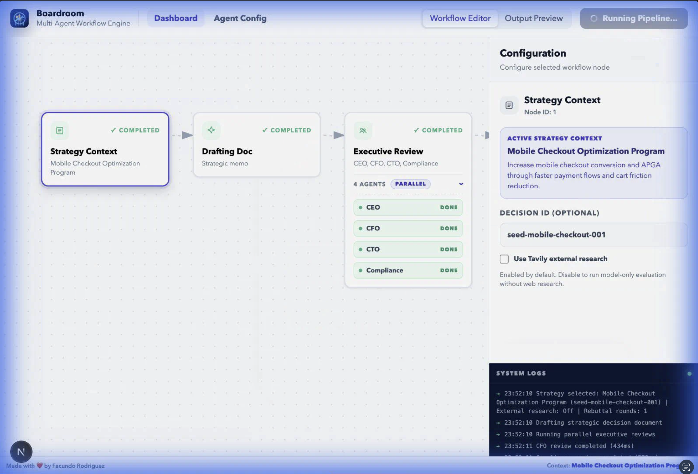
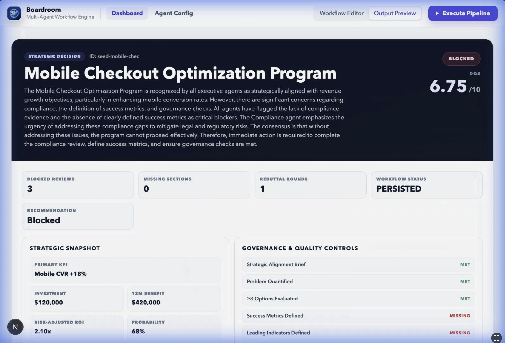

# Boardroom

## Purpose
Boardroom operationalizes a structured [Strategic Decision Framework](docs/Strategic-Decision-Making-Framework.md) into a multi-agent decision governance system.

It evaluates a single strategic initiative as an investment decision — not just a feature proposal.

Through executive-style AI reviewers, it:
	•	Stress-tests assumptions
	•	Forces explicit trade-offs
	•	Models downside exposure
	•	Evaluates capital efficiency
	•	Surfaces compliance and risk implications

Each decision is scored across two dimensions:
	•	Hygiene (are the right artifacts and guardrails in place?)
	•	Substance (does the strategic and economic logic hold?)

Boardroom then synthesizes the analysis and applies governance logic to classify the outcome as:
	•	Approved — Decision meets strategic, financial, and risk thresholds
	•	Challenged — Gaps or weak trade-offs require revision
	•	Blocked — Risk, compliance, or capital exposure is unacceptable

The goal isn’t to automate strategy.

It’s to institutionalize disciplined decision-making — making capital allocation, downside modeling, and governance explicit before execution begins.

## UI Preview

**Dashboard**

**Strategy Details**

**Workflow Editor**

**Agent Config**

**Output Preview**

## General Usage
1. Configure environment variables from `.env.example`.
2. Load strategic decisions into PostgreSQL.
3. Start the app with `npm run dev`.
4. Run the workflow from the web UI (`/`) or via `POST /api/workflow/run`.

## Strategic Decision Artifact Creation
A workflow input artifact is persisted in PostgreSQL and consists of:
- `decisions`: decision metadata (`id`, `name`, `status`, and supporting fields).
- `decision_documents`: long-form decision body text used by reviewers.
- `decision_governance_checks`: optional pre-marked governance gates.

How to create artifacts:
1. Seed sample artifacts: `npm run db:seed -- --reset`.
2. Or insert/upsert your own records through your ingestion flow into `decisions` + `decision_documents`.

Note: the in-app "Create Strategy" stage currently builds local draft artifacts for editing and does not persist new strategy records to PostgreSQL.

## Workflow Steps
1. Build decision context from stored metadata, document text, and inferred governance checks.
2. Run executive review agents (core agents plus optional custom agents).
3. Run optional cross-agent interaction rounds (`0..3`) to refine reviews.
4. Generate chairperson synthesis.
5. Compute DQS from weighted review scores.
6. Apply gate decision (`Approved`, `Challenged`, or `Blocked`).
7. Generate PRD output for approved decisions.
8. Persist reviews, synthesis, PRD (if approved), and workflow run history.

## Output
Each run produces:
- Decision status updates on the source decision.
- Agent reviews in `decision_reviews` (including chairperson review row).
- Chairperson synthesis in `decision_synthesis`.
- PRD output in `decision_prds` when approved.
- A workflow run record in `workflow_runs` with DQS, gate decision, and state snapshot.

# Next steps
- Add vector DB for use previous decisions and reviews as context.
- Add an assitant for creating the Strategic Decision artifact.

# Contributions
Feel free to fork the repo, open an issue, or submit a pull request.