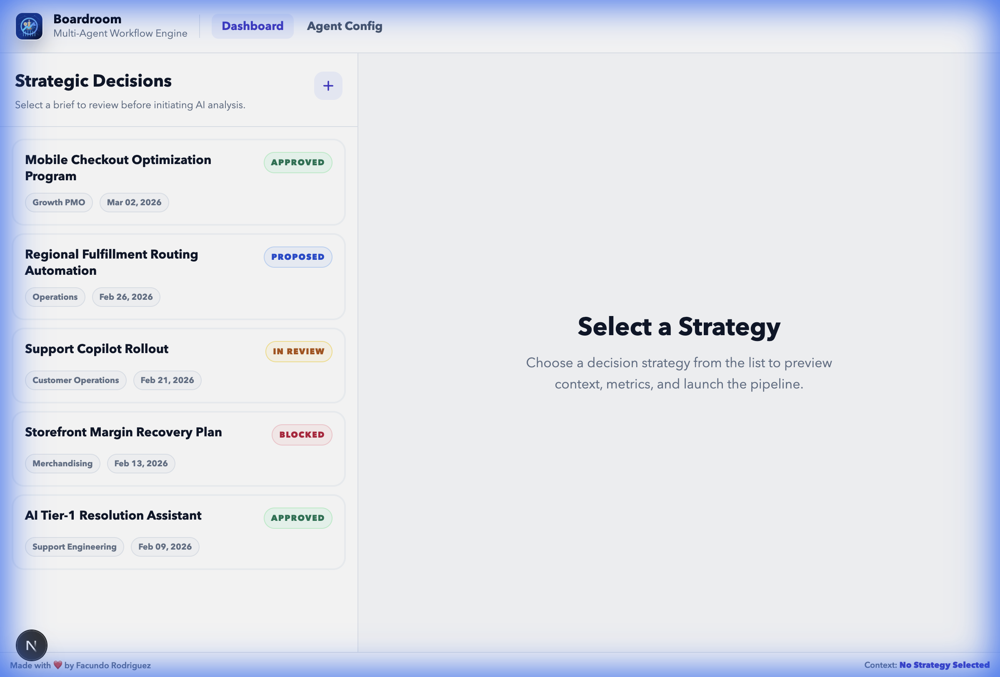
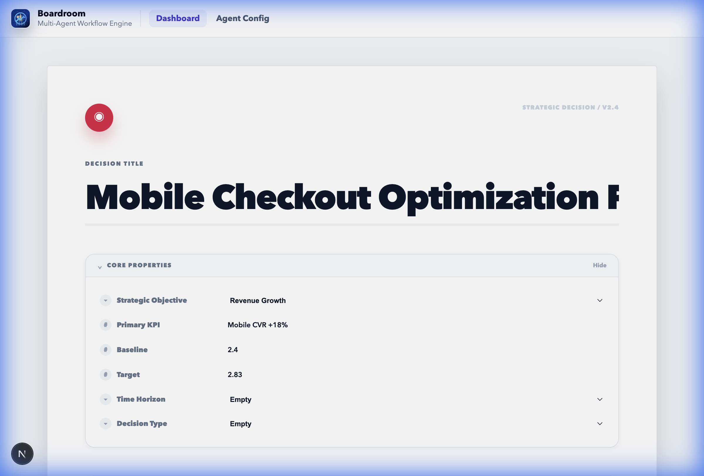
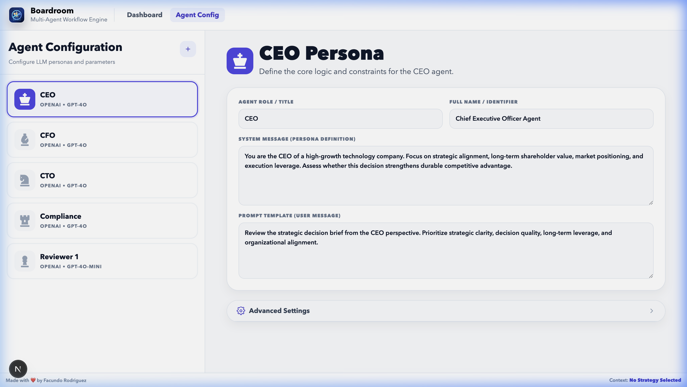
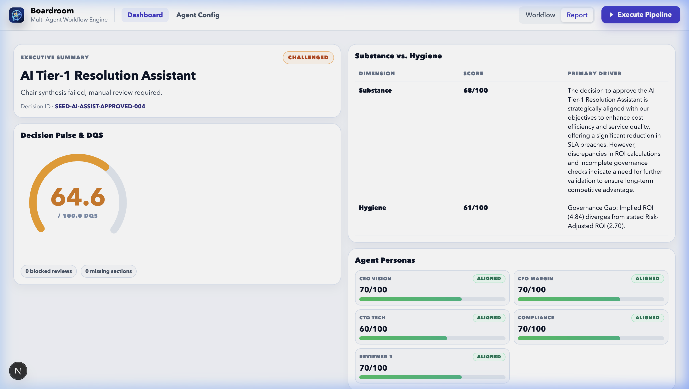
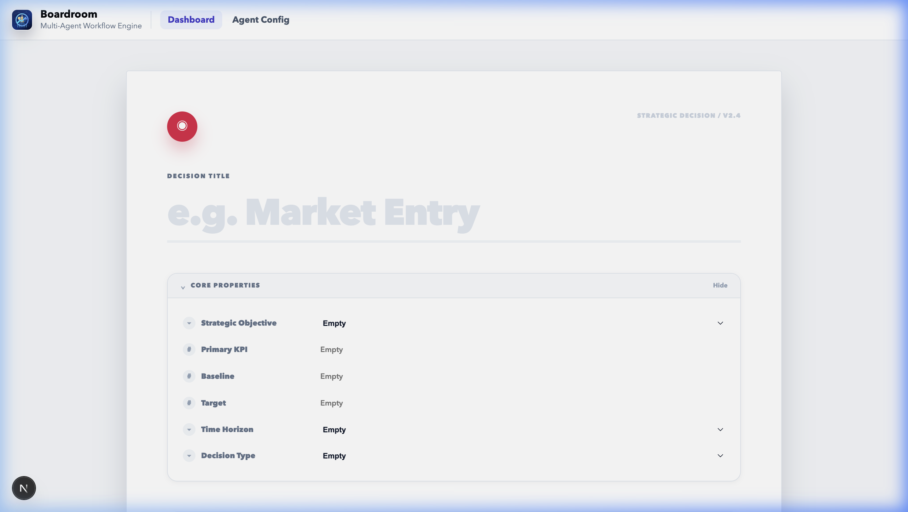

# Boardroom

## Purpose
Boardroom operationalizes a structured [Strategic Decision Framework](docs/Strategic-Decision-Making-Framework.md) into a multi-agent decision governance system.

It evaluates a single strategic initiative as an investment decision — not just a feature proposal.

Through executive-style AI reviewers, it:
	•	Stress-tests assumptions
	•	Forces explicit trade-offs
	•	Models downside exposure
	•	Evaluates capital efficiency
	•	Surfaces compliance and risk implications

Each decision is scored across two dimensions:
	•	Hygiene (are the right artifacts and guardrails in place?)
	•	Substance (does the strategic and economic logic hold?)

Boardroom then synthesizes the analysis and applies governance logic to classify the outcome as:
	•	Approved — Decision meets strategic, financial, and risk thresholds
	•	Challenged — Gaps or weak trade-offs require revision
	•	Blocked — Risk, compliance, or capital exposure is unacceptable

The goal isn’t to automate strategy.

It’s to institutionalize disciplined decision-making — making capital allocation, downside modeling, and governance explicit before execution begins.

## UI Preview

**Dashboard**

**Strategy Details**

**Workflow**

**Agent Config**

**Report**

**Create Strategy**

## Live Governance Briefing UI

Boardroom now presents report output as a **Live Governance Briefing** using an inverted-pyramid structure:

1. **Outcome layer**: decision status (`Approved`, `Challenged`, `Blocked`), DQS gauge, and one-sentence chairperson verdict.
2. **Substance vs. Hygiene layer**: side-by-side scorecard with primary drivers.
3. **Debate and evidence layer**: consensus points, primary contention, external citations, live research feed, and refinement log.
4. **Implementation layer**: PRD summary, risk register, and Decision Ancestry save action.

See the full UI contract in [docs/live-governance-briefing.md](docs/live-governance-briefing.md).

## Non-Technical Local Start (PM, CEO, Founder)
Use this path if you want a guided setup with almost no manual config.

1. Install [Node.js 20+](https://nodejs.org/en/download) and [Docker Desktop](https://www.docker.com/products/docker-desktop/).
2. Choose how to start:
   - Zero data: `npm run local:start`
   - Demo data: `npm run local:start:demo`
   - Fresh reset to zero data: `npm run local:start:fresh`
3. Follow the prompts (it can auto-create `.env`, start local PostgreSQL, and ask for one AI key).
4. Open `http://localhost:3000`.

macOS option: double-click `Start-Boardroom.command`.

Full guide: [docs/non-technical-local-run.md](docs/non-technical-local-run.md)

## General Usage
1. Configure environment variables from `.env.example`.
2. Load strategic decisions into PostgreSQL.
3. Start the app with `npm run dev`.
4. Run the workflow from the web UI (`/`) or via `POST /api/workflow/run`.

## Strategic Decision Artifact Creation
A workflow input artifact is persisted in PostgreSQL and consists of:
- `decisions`: decision metadata (`id`, `name`, `status`, and supporting fields).
- `decision_documents`: long-form decision body text used by reviewers.
- `decision_governance_checks`: optional pre-marked governance gates.

How to create artifacts:
1. Seed sample artifacts: `npm run db:seed -- --reset`.
2. Or insert/upsert your own records through your ingestion flow into `decisions` + `decision_documents`.

Note: the in-app "Create Strategy" stage currently builds local draft artifacts for editing and does not persist new strategy records to PostgreSQL.

## Workflow Steps
1. Build decision context from stored metadata, document text, and inferred governance checks.
2. Retrieve top-3 similar historical decisions and outcomes from a persisted decision-ancestry vector store (with lexical fallback when vectors are unavailable).
3. Run automated hygiene checks for quantitative consistency, including structured table/spreadsheet parsing and metadata/document contradiction checks.
4. Run executive review agents (core agents plus optional custom agents and optional red-team personas).
5. Run optional cross-agent interaction rounds (`0..3`) to refine reviews.
6. Generate chairperson synthesis with weighted conflict resolution and evidence citations from reviewer outputs.
7. Compute DQS from weighted review scores, dissent penalties, confidence penalties, and hygiene blend.
8. Apply gate decision (`Approved`, `Challenged`, or `Blocked`).
9. Generate PRD output for approved decisions.
10. Persist reviews, synthesis, PRD (if approved), and workflow run history.

## Output
Each run produces:
- Decision status updates on the source decision.
- Agent reviews in `decision_reviews` (including chairperson review row).
- Chairperson synthesis in `decision_synthesis`.
- PRD output in `decision_prds` when approved.
- A workflow run record in `workflow_runs` with DQS, gate decision, and state snapshot.

# Next steps
- Add asynchronous embedding backfill/refresh jobs for very large historical decision catalogs.
- Expand hygiene table parsing to handle multi-sheet financial exports and scenario tabs.
- Add UI surfacing for ancestry retrieval mode and chairperson evidence citations in run reports.

# Contributions
Feel free to fork the repo, open an issue, or submit a pull request.
