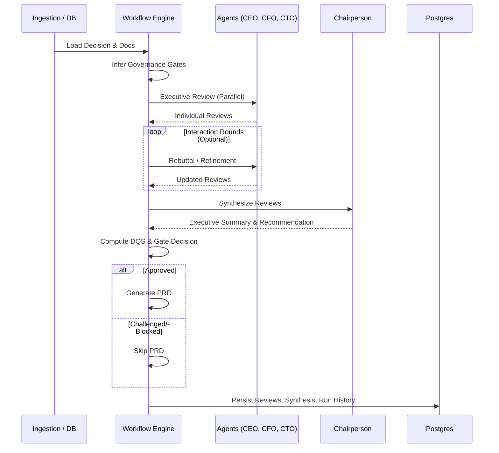

# Boardroom Architecture (Next.js + PostgreSQL)

## Core Flow

1. `build_decision`

- Fetch decision metadata + body text from PostgreSQL (`decisions`, `decision_documents`).
- Infer governance gates from text.
- Auto-mark inferred governance checks in `decision_governance_checks`.
- Retrieve top similar prior decisions + outcomes via vector-memory similarity from `decision_ancestry_embeddings` (with lexical fallback).
- Compute automated hygiene checks (financial consistency + metadata/document coherence), including structured table parsing for projected-revenue vs market-size sanity checks.
- Move decision status to `Under Evaluation` or `Incomplete`.

2. `executive_review`
- Run normalized review-agent configs (core agents plus optional custom reviewers).
- Agent runtime config (provider/model/system/user/temperature/max tokens) comes from `agent_configs`, with defaults when no persisted config exists.
- Each agent uses its configured provider client (`OpenAI`, `Anthropic`, `Mistral`, `Meta`).
- Prompt templates are configurable per agent; prompt markdown in `src/prompts/*_v3.md` is used as a fallback.
- When `TAVILY_API_KEY` is configured and `includeExternalResearch` is `true` (default `false`), each review agent runs a Tavily search and receives recent external evidence with source URLs in prompt context.
- Remote workflow runs can require explicit approval via `x-boardroom-run-approval` depending on policy env vars.
- Bulk run execution is capped by `BOARDROOM_MAX_BULK_RUN_DECISIONS`.
- LLM output is parsed via JSON fallback extraction and validated with Zod.

3. `interaction_rounds`
- Optional cross-agent rebuttal loop (default `1`, configurable `0..3` per run).
- Each reviewer re-evaluates with peer-review summaries + its own prior output.
- Workflow stores round-level deltas (`score_delta` and `blocked` flips) in `state_json`.

4. `synthesize_reviews`
- Chairperson agent produces executive summary and final recommendation.
- Weighted conflict resolution gives stronger effect to risk/compliance dissent than growth optimism.
- Chairperson output is required to include evidence citations sourced from reviewer theses/blockers/revisions.

5. `calculate_dqs`
- DQS starts from a weighted mean over configured review agents:
  - core weights: `CEO=0.30`, `CFO=0.25`, `CTO=0.25`, `Compliance=0.20`
  - each additional custom reviewer uses weight `0.20`
  - `DQS = SUM(score_i * weight_i) / SUM(weight_i)`
- Then applies weighted conflict adjustments:
  - dissent penalties (CFO/Compliance dissent weighted highest)
  - confidence penalties (low specialized-agent confidence)
  - hygiene blend (automated hygiene score contributes to final DQS)

6. gate decision
- `Blocked` if any review blocks.
- `Challenged` if hygiene/confidence guardrails fail or `DQS < 7.0`.
- `Approved` otherwise.

7. `generate_prd` (approved only)
- Build structured PRD sections from decision text + review feedback.

8. `persist_artifacts`
- Upsert executive reviews in `decision_reviews`.
- Upsert chairperson synthesis in `decision_synthesis`.
- Upsert PRD in `decision_prds` when approved.
- Append run record in `workflow_runs`.

## Runtime Surfaces

- Web UI: `/`
- Workflow Editor: full-page execution monitor with Decision Pulse canvas, persistent control aside, and unified Execution Trace.
- Report: Live Governance Briefing (Outcome -> Scorecard -> Debate/Evidence -> Artifacts) in a three-column layout.
- API: `POST /api/workflow/run`
- API: `GET /api/workflow/runs` (decision run history)
- API: `GET /api/strategies`
- API: `GET /api/strategies/:decisionId`
- API: `GET|PUT /api/agent-configs`
- API: `GET /api/health`

## Main Code

- `src/workflow/decision_workflow.ts` orchestration
- `src/config/agent_config.ts` normalized/persisted agent config model
- `src/config/llm_providers.ts` provider/model/env-key registry
- `src/llm/client.ts` provider client implementations
- `src/agents/base.ts` agent execution + parsing
- `src/workflow/prd.ts` PRD synthesis helpers
- `src/workflow/gates.ts` governance checks
- `src/store/postgres.ts` PostgreSQL schema + repository functions

## Legacy Archive

- No archived legacy implementation directory is currently tracked in this repository root.
