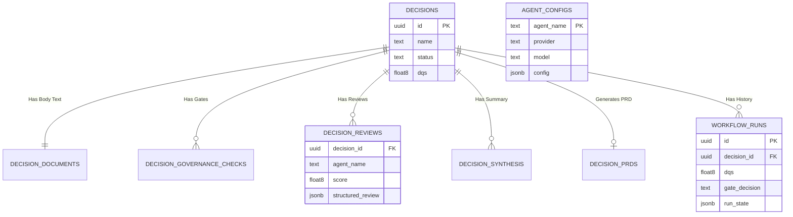

# Data Model

Tables are created automatically from `src/store/postgres.ts` on first database access.

## Core Decision Tables
- `decisions`
  - Strategic decision metadata (`id`, `name`, `status`, owner/date/summary + scoring context fields).
- `decision_documents`
  - One document body per decision (`decision_id`, `body_text`).
- `decision_governance_checks`
  - Governance gate flags per decision (`decision_id`, `gate_name`, `is_checked`).

## Workflow Output Tables
- `decision_reviews`
  - One row per decision/agent with normalized review output fields.
- `decision_synthesis`
  - Chairperson summary and recommendation.
- `decision_prds`
  - Generated PRD output for approved decisions.
- `workflow_runs`
  - Immutable run history records with DQS, gate decision, workflow status, and state snapshot.

## Runtime Support Tables
- `agent_configs`
  - Persisted runtime agent configurations used by review workflow.
- `rate_limits`
  - Rate-limiter buckets for API protection when PostgreSQL backend is enabled.
